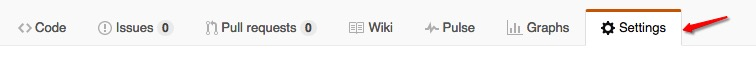
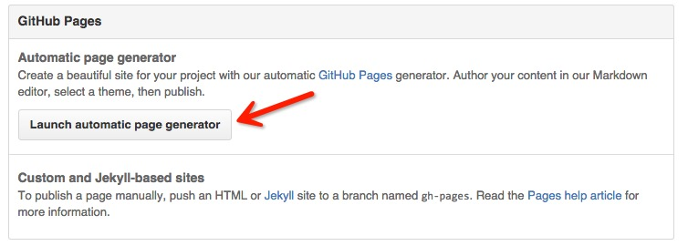
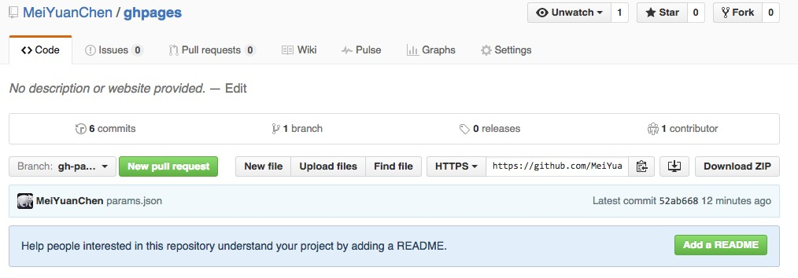
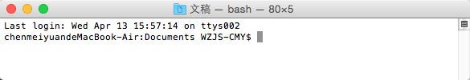
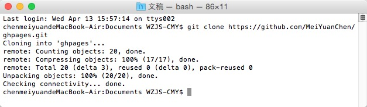
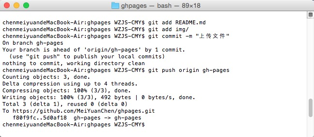

<h2>把作品（html）上传到gh-pages</h2>

第一步:项目创建好后，点击Settings选项卡

第二步：点击Launch automatic page generator按钮

第三步：依次点击Continue to layouts、Publlsh page按钮

 

第四步，删除所有文件

第五步：在命令行进入你平时放项目的文件夹，我进入了我的文档文件夹里面

第六步：clone项目克隆到本地

第七步：把项目文件复制粘贴到刚才从github克隆的文件夹

第八步：在命令行进入刚才从github克隆的文件夹，依次输入add、commit push命令

